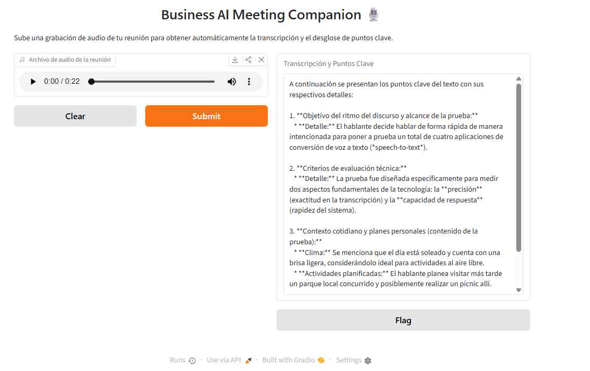

# 🎙 Business AI Meeting Companion

[](https://www.python.org/)
[](https://gradio.app/)
[](https://huggingface.co/openai/whisper-tiny.en)
[](https://ai.google.dev/)

An intelligent meeting assistant that transcribes local audio recordings using **OpenAI Whisper** and generates structured key points and summaries using the **Google Gemini API**.

---

## 📸 Demo



---

## ✨ Features

- **Local Speech-to-Text:** Fast audio transcription powered by `openai/whisper-tiny.en`.
- **LLM Insights:** Automatic key points extraction and structured summaries using `gemini-2.5-flash`.
- **Interactive Web Interface:** User-friendly UI built with Gradio for seamless audio uploads and instant viewing.
- **Secure Key Management:** Local `.env` configuration to ensure API credentials remain private.

---

## 🛠️ Tech Stack

| Component | Technology |
| :--- | :--- |
| **Language** | Python 3.10+ |
| **UI Framework** | Gradio |
| **Speech-to-Text** | Hugging Face Transformers (`openai/whisper-tiny.en`) |
| **Audio Processing** | FFmpeg |
| **LLM Provider** | Google Gemini API (`google-genai` SDK) |

---

## 📂 Repository Structure

```text
├── app.py              # Main application logic and Gradio UI
├── requirements.txt    # Python dependencies
├── .env.example        # Environment variables template
├── .gitignore          # Git ignore rules
├── text.png            # Application interface preview
└── README.md           # Project documentation
```

---

## 🚀 Quick Start

### 1. Install System Dependency (FFmpeg)
FFmpeg is required for processing audio files locally:
- **Windows:** `winget install FFmpeg`
- **macOS:** `brew install ffmpeg`
- **Linux:** `sudo apt install ffmpeg`

### 2. Environment Setup
Clone the repository and set up a Python virtual environment:

```bash
# Clone the repository
git clone https://github.com/your-username/Business-AI-Meeting-Companion.git
cd Business-AI-Meeting-Companion

# Create virtual environment
python -m venv venv

# Activate virtual environment
# Windows:
venv\Scripts\activate
# macOS/Linux:
source venv/bin/activate

# Install dependencies
pip install -r requirements.txt
```

### 3. API Key Configuration
Create a `.env` file from the `.env.example` template:

```bash
# Windows:
copy .env.example .env
# macOS/Linux:
cp .env.example .env
```

Open `.env` and set your API key:
```env
GEMINI_API_KEY="your_actual_gemini_api_key_here"
```

### 4. Run the Application

```bash
python app.py
```

Open your web browser and go to `[http://127.0.0.1:7860](http://127.0.0.1:7860)`.
